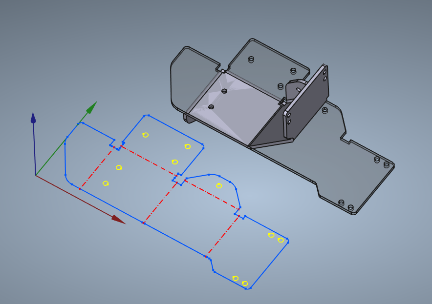

[unfold.py](./unfold.py) aims to be a drop in replacement for FreeCAD's sheet metal workbench unfold command. It is currently in alpha condition, but can already unfold many shapes that the existing unfolder can't. It relies on [NetworkX](https://pypi.org/project/networkx/) for a significant performance boost compared to the existing unfolder.

